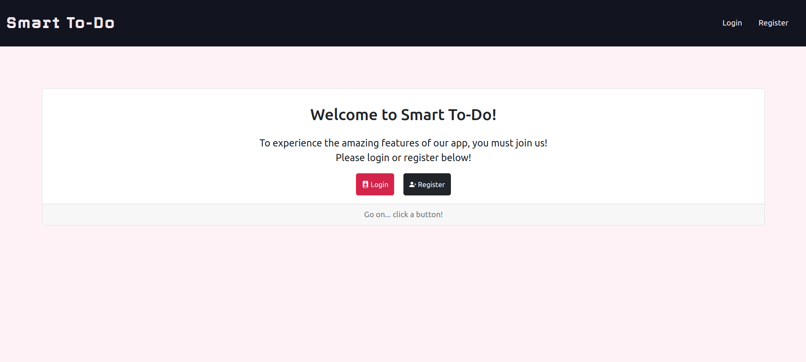
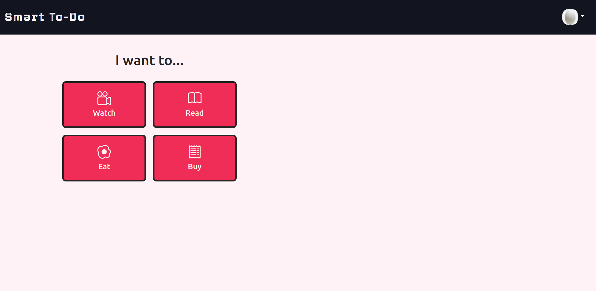
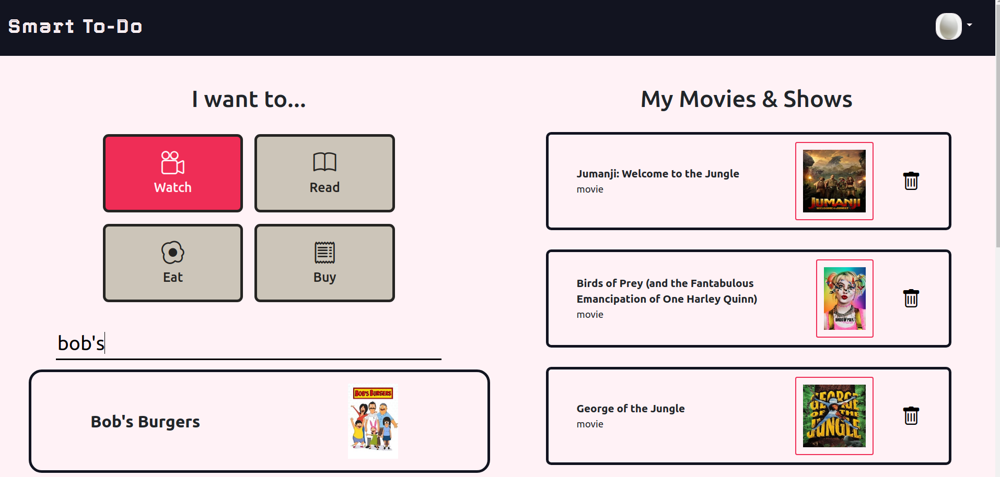
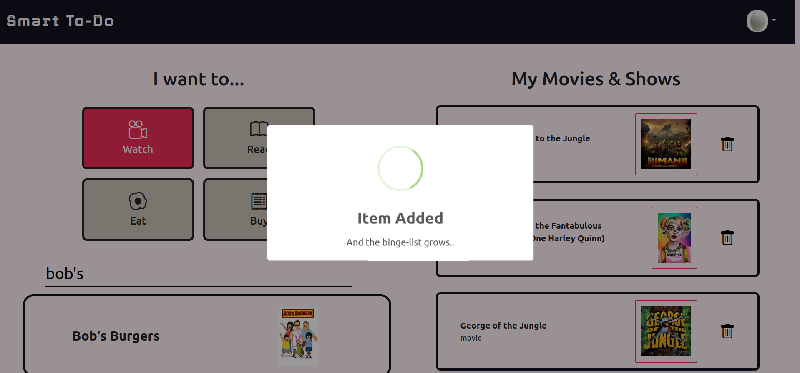

# Smart To-Do

#### This application was built in one week as a Lighthouse Labs Web Development Bootcamp assignment.

Smart To-Do takes your notes app and turns it on its head. 
Gone are the days of searching through all your notes just to find a movie someone recommended to you. With Smart To Do, your movies, tv shows, books, restaurants, and shopping list are all stored conveniently in one place, and can be accessed on any device, simply by logging in.

### The Stack:
#### Frontend:
##### - HTML
##### - CSS
##### - JS
##### - jQuery
##### - AJAX
##### - Bootstrap 5
##### - EJS
##### - SCSS
#### Backend:
##### - Node
##### - Express
##### - Postgres SQL

## Want to try it out?

#### *Hosting coming soon...*

## See it in action:

## Dependencies

- Node 10.x or above
- NPM 5.x or above
- PG 6.x
- EJS

